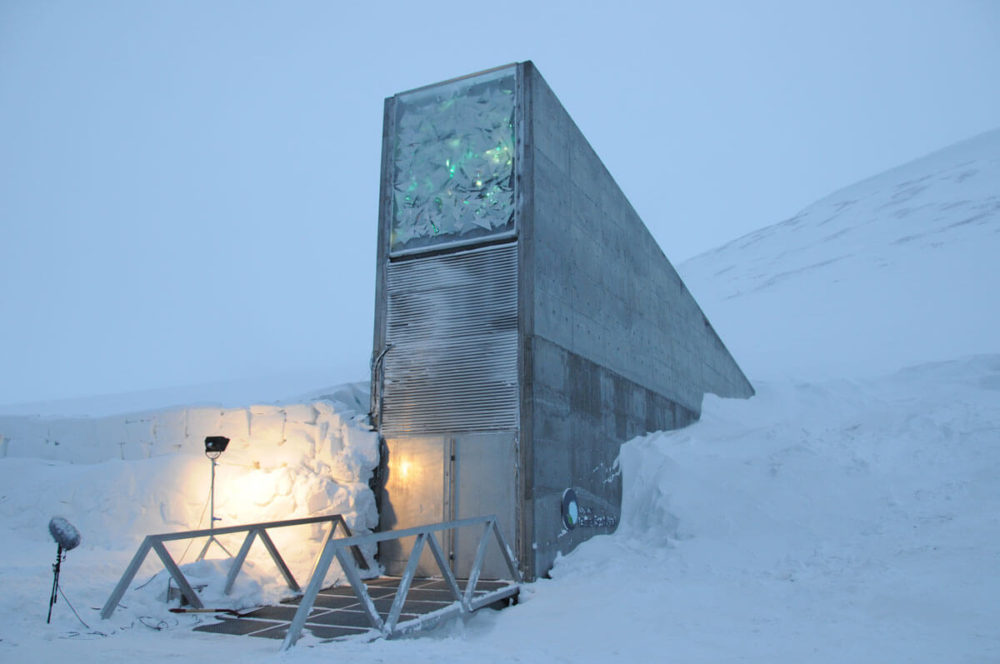
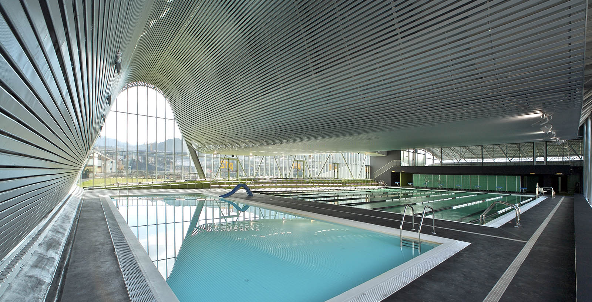

[← Volver al inicio](README.md)
# Temas del curso
### 1/10/2026-Premios princesa
 La Bóveda Global de Semillas de Svalbard cuyo objetivo es salvaguardar la diversidad de semillas de cultivos
 destinados a alimentación para garantizar el suministro futuro en caso de pérdida debida 
 a desastres naturales, conflictos humanos, cambios en las políticas, mala gestión o
 cualquier otra circunstancia. Su explicación por la que fue premiado se puede ver mejor en [la pagina oficial](https://www.fpa.es/es/premios-princesa-de-asturias/premiados/2026-boveda-global-de-semillas-svalbard/).
 Elegí este temas ya que me intereso su objetivo y me parece algo muy utíl y necesario.

esta imagen la saque buscando en [harolds lp](https://elheraldoslp.com.mx/new/wp-content/uploads/2022/02/Banco-Global-de-Semillas-de-Svalbard.jpg)
### 18/09 — Natación

Pues ahora no hago nada pero voy a empezar el gimnasio pero antes hacia 
natación la cual practique en diciembre hasta marzo ya que me iba a meter al gimnasio
pero no he ido casi, natación me gusto mucho pero no era algo que me agradaba,
iba los lunes, miércoles y viernes.

[curso de natación](https://github.com/gmadridsports/app-natacion)
